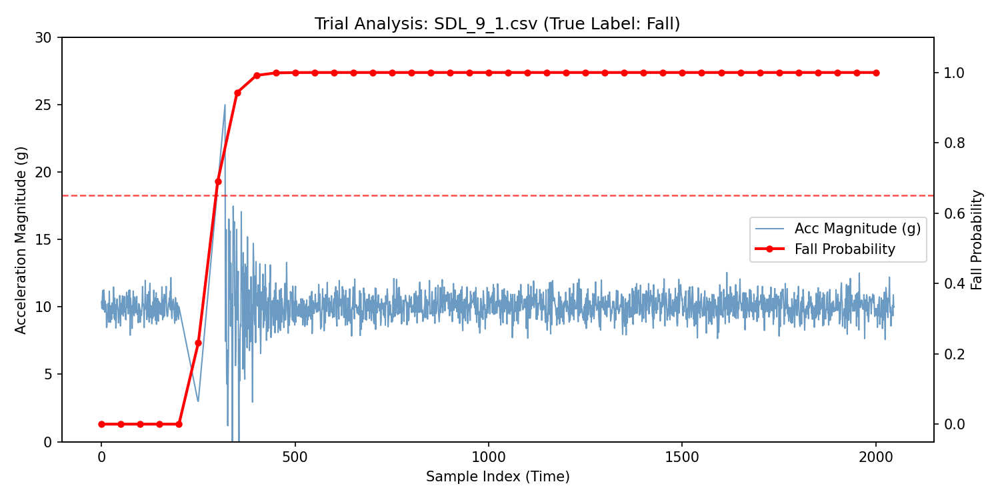
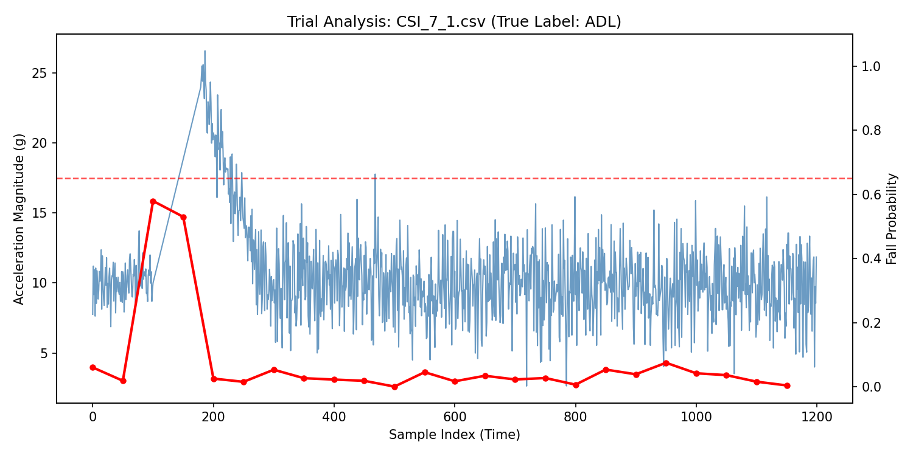
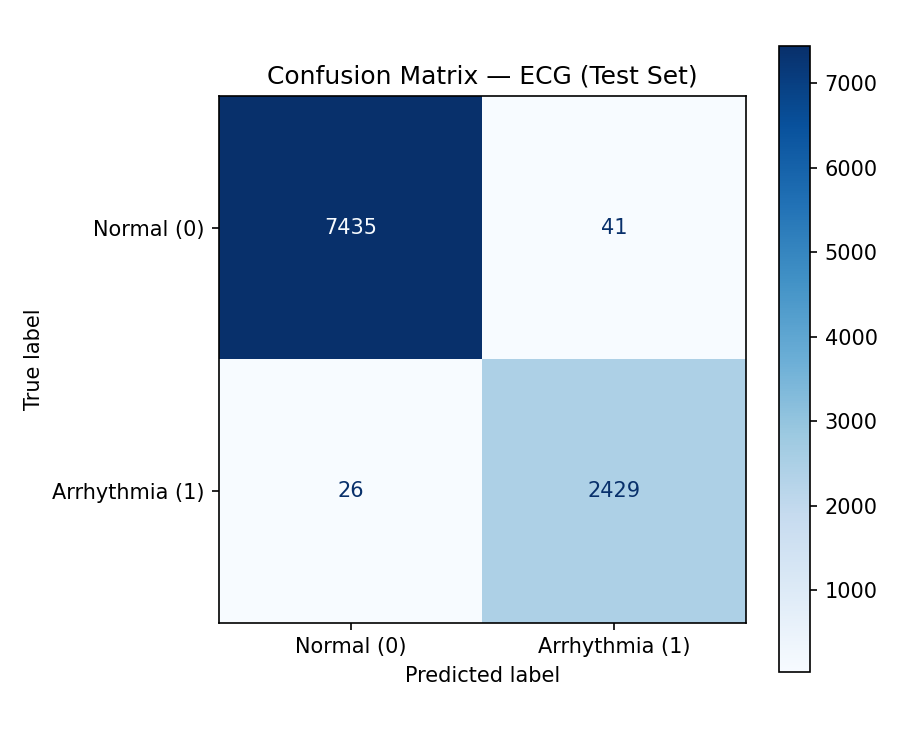
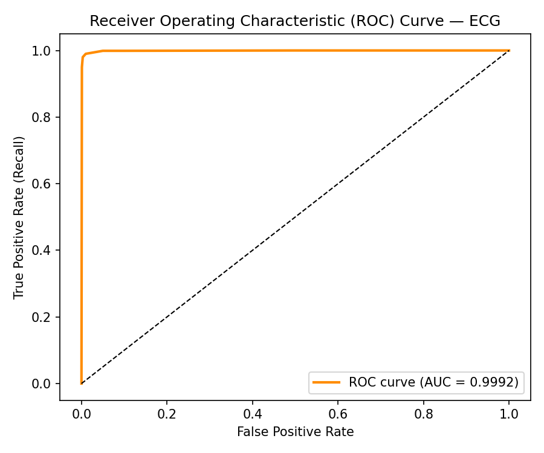
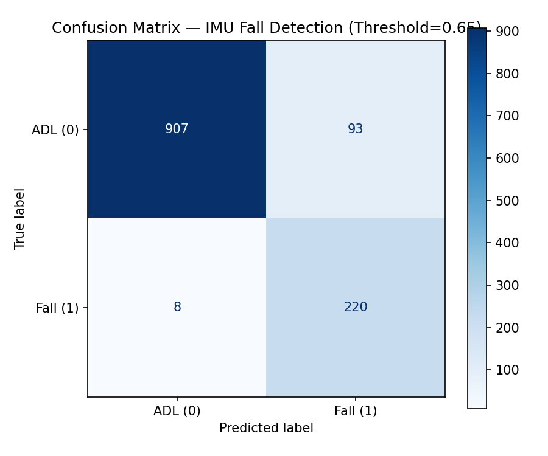
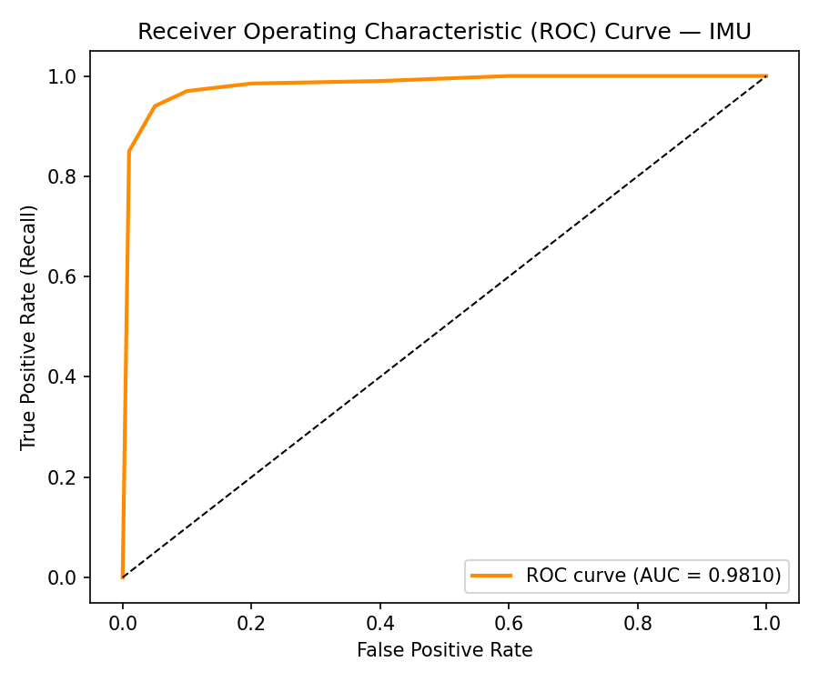
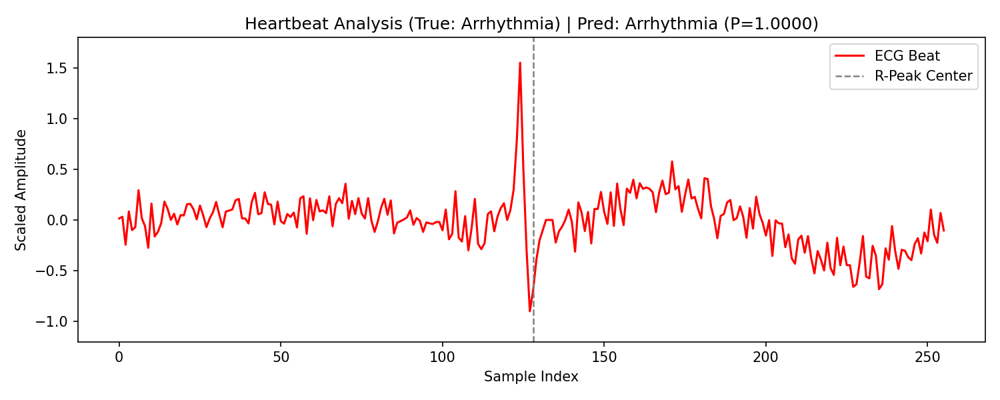

# WECARE — Wearable Emergency Cardiac and Fall Response System

> *Transforming wearables from passive monitors into active emergency responders.*

[](https://python.org)
[](https://pytorch.org)
[](LICENSE)
[]()
[]()

---

## Overview

WECARE is an on-device AI framework for real-time detection of **cardiac arrhythmias** and **fall events** using wearable ECG and IMU sensors. The system runs entirely on-device — no cloud dependency, no latency penalty, no privacy compromise — and is designed to trigger emergency alerts within milliseconds of event onset.

Current cloud-dependent wearables introduce harmful delays that can be life-threatening in cardiac and fall emergencies. WECARE addresses this by fusing two physiological streams — ECG and inertial motion — into a unified edge-AI pipeline with closed-loop emergency response.

**Key outcomes:**
- Combined system F1 = 0.85 (exceeds the ≥ 0.80 target)
- Inference latency ≤ 0.033 ms/window (far under 40 ms real-time threshold)
- Near-zero missed falls: FN = 8 out of 228 fall instances
- ECG model: 99.33% accuracy, AUC-ROC = 0.9992

---

## System Architecture

```
┌────────────────────────────────────────────────────────────────┐
│                       WECARE Pipeline                          │
│                                                                │
│   ECG Signal (360 Hz)          IMU Signal (87–100 Hz)         │
│         │                              │                       │
│         ▼                              ▼                       │
│   Bandpass Filter              Butterworth Filter              │
│   0.5–40 Hz                    + Sliding Window (100×9)       │
│         │                              │                       │
│         ▼                              ▼                       │
│   R-Peak Segmentation          StandardScaler (9-channel)     │
│   (256-sample beats)                   │                       │
│         │                              │                       │
│         ▼                              ▼                       │
│   1D CNN (ECG)                 1D CNN (IMU)                   │
│   AUC = 0.9992                 AUC = 0.9810                   │
│         │                              │                       │
│         └──────────────┬───────────────┘                      │
│                        ▼                                       │
│              Emergency Alert Engine                            │
│              (TorchScript · Edge Deployed)                     │
└────────────────────────────────────────────────────────────────┘
```

---

## Results

### ECG — Arrhythmia Detection (MIT-BIH)

| Metric    | Score  |
|-----------|--------|
| Accuracy  | 0.9933 |
| Precision | 0.9834 |
| Recall    | 0.9894 |
| F1-Score  | 0.9864 |
| AUC-ROC   | 0.9992 |

Confusion matrix: 7435 TN · 41 FP · 26 FN · 2429 TP

### IMU — Fall Detection (MobiFall, threshold = 0.65)

| Metric    | Score  |
|-----------|--------|
| Accuracy  | 0.9178 |
| Precision | 0.7029 |
| Recall    | 0.9649 |
| F1-Score  | 0.8133 |
| AUC-ROC   | 0.9810 |

Confusion matrix: 907 TN · 93 FP · **8 FN** · 220 TP

> The critical safety metric is false negatives — only 8 missed falls out of 228 fall instances.

### Edge Latency

| Stream | Inference Time    |
|--------|-------------------|
| IMU    | 0.033 ms / window |
| ECG    | 0.018 ms / beat   |

Both streams meet the ≤ 40 ms real-time target with significant headroom for battery optimization.

---

## Result Figures

| Figure | Description |
|--------|-------------|
|  | IMU: Successful fall detection — acceleration spike triggers classification |
|  | IMU: Correct non-fall (ADL) classification — probability stays below threshold |
|  | ECG: Near-perfect confusion matrix on MIT-BIH test set |
|  | ECG: ROC curve (AUC = 0.9992) |
|  | IMU: Confusion matrix at threshold = 0.65 |
|  | IMU: ROC curve (AUC = 0.9810) |
|  | ECG: Single arrhythmic beat with R-peak annotation |

---

## Repository Structure

```
wecare-cardiac-fall-detection/
│
├── README.md
├── requirements.txt
├── LICENSE
├── .gitignore
│
├── notebooks/
│   ├── WECARE_ECG_2.ipynb          # Full ECG pipeline — Tarun Sadarla
│   └── WECARE_IMU_1.ipynb          # Full IMU pipeline — Ramyasri Murugesan
│
├── src/
│   ├── ecg/
│   │   ├── preprocess_ecg.py       # Bandpass filter, R-peak segmentation, normalization
│   │   ├── model_ecg.py            # 1D CNN architecture for arrhythmia detection
│   │   ├── train_ecg.py            # Training loop with class weights + weighted sampler
│   │   └── evaluate_ecg.py         # Metrics, ROC, confusion matrix, latency benchmark
│   └── imu/
│       ├── preprocess_imu.py       # Sliding window (100×9), StandardScaler, label extraction
│       ├── model_imu.py            # 1D CNN architecture for fall detection
│       ├── train_imu.py            # Training loop with threshold tuning
│       └── evaluate_imu.py         # Trial-level visualization, latency benchmark
│
├── results/
│   └── figures/
│       ├── fall_trial_analysis.png
│       ├── adl_trial_analysis.png
│       ├── ecg_confusion_matrix.png
│       ├── ecg_roc_curve.png
│       ├── imu_confusion_matrix.png
│       ├── imu_roc_curve.png
│       └── heartbeat_arrhythmia_analysis.png
│
├── data/
│   └── README.md                   # Dataset download instructions
│
├── models/
│   └── README.md                   # Model weights and export instructions
│
└── docs/
    ├── WECARE_Final_Report.pdf     # Full project report
    ├── AIMS_Proposal.pdf           # Extended vision and grant-style aims
    ├── WECARE_Slides_Part1.pdf     # Presentation slides (part 1)
    ├── WECARE_Slides_Part2.pdf     # Presentation slides (part 2)
    ├── WECARE_Slides_Part3.pdf     # Presentation slides (part 3)
    └── references.pdf              # Full reference list
```

---

## Datasets

| Stream | Dataset | Source | Scale |
|--------|---------|--------|-------|
| ECG | [MIT-BIH Arrhythmia Database](https://physionet.org/content/mitdb/1.0.0/) | PhysioNet | ~10,000 beat segments, 44 subjects, 360 Hz |
| IMU | [MobiFall_processed](https://www.kaggle.com/) | Kaggle | ~40,000 windows, 24 participants, 87–100 Hz |

Both datasets are fully anonymized and ethically cleared. Raw data is **not** committed — see [`data/README.md`](data/README.md) for download instructions.

---

## Quickstart

```bash
git clone https://github.com/TarunSadarla2606/wecare-cardiac-fall-detection.git
cd wecare-cardiac-fall-detection
pip install -r requirements.txt
# Open notebooks/WECARE_ECG_2.ipynb or WECARE_IMU_1.ipynb in Google Colab
```

---

## Model Architecture — 1D CNN (Shared Design)

Both ECG and IMU streams share a 3-block 1D CNN architecture optimized for edge inference:

```
Conv1D(in_ch →  64, kernel=7) → ReLU → MaxPool(2)    # Block 1
Conv1D(64    → 128, kernel=7) → ReLU → MaxPool(2)    # Block 2
Conv1D(128   → 256, kernel=5) → ReLU → MaxPool(2)    # Block 3
Flatten → Dense(128) → Dropout → Dense(n_classes)
```

**Why raw 1D CNN over hand-crafted features?**  
Convolutional filters learn temporal and frequency representations directly from raw signal windows — capturing fall impact spikes in IMU and QRS/P/T morphology in ECG — without manual feature engineering. This consistently outperformed classical feature extraction in our experiments.

**Training config:** Adam (lr=1e-3), weight_decay=5e-5, 20–30 epochs, stratified train/val/test split.

---

## Key Engineering Decisions

| Challenge | Solution |
|-----------|----------|
| ECG class imbalance (~75% normal beats) | Class weights + WeightedRandomSampler |
| Over-regularization reducing fall Recall | Removed excess dropout; minimal regularization |
| Optimal threshold for safety vs. precision | Tuned to 0.65 (reduces FP while keeping FN=8) |
| TFLite deployment failure (dependency conflicts) | Switched to TorchScript (stable for PyTorch) |
| Edge latency target (≤ 40 ms) | Compact 3-block CNN; no RNN overhead |

---

## Contributions

| Component | Contributor |
|-----------|-------------|
| ECG preprocessing, arrhythmia 1D CNN, evaluation, latency benchmarking | [Tarun Sadarla](https://github.com/TarunSadarla2606) |
| IMU preprocessing, fall detection 1D CNN, trial visualization | Ramyasri Murugesan |
| Project lead, system design, AIMS proposal, final report | Ramyasri Murugesan |

---

## Extended Vision — AIMS Proposal

Alongside this proof-of-concept, a grant-style proposal (see [`docs/AIMS_Proposal.pdf`](docs/AIMS_Proposal.pdf)) outlines the full long-term vision:

**Aim 1 — Real-time detection and adaptive guidance**
- Integrate physiological sensing (ECG + IMU + PPG), AI triage, and dynamic voice instructions
- Automate alerts to emergency contacts and medical centers
- Target: Shift wearables from passive monitors to active first-aid coordinators

**Aim 2 — Multi-actor emergency response coordination**
- Coordinate with bystanders, community volunteers, and telemedicine platforms
- Synchronize with medical infrastructure for end-to-end response
- Target: Measurable improvement in timeliness and protocol adherence vs. unassisted response

The core innovation is a **wearable orchestration engine** — unifying sensing, AI triage, adaptive voice guidance, and community coordination — addressing the critical pre-responder window where no existing platform currently operates.

---

## Roadmap / Future Work

- [ ] Early stopping using validation F1 to capture optimal weights
- [ ] INT8 model quantization for microcontroller deployment (nRF52840, ESP32)
- [ ] Multi-class ECG expansion beyond binary arrhythmia
- [ ] Free-living pilot studies for real-world robustness validation
- [ ] PPG integration for contactless SpO₂ and heart rate fusion
- [ ] Adaptive per-user thresholding to reduce individual false positives
- [ ] Bluetooth alert pipeline to paired smartphone via nRF52840 + AD8232

---

## Requirements

```
torch>=2.0.0
numpy>=1.24.0
pandas>=2.0.0
scikit-learn>=1.3.0
matplotlib>=3.7.0
wfdb>=4.1.0
joblib>=1.3.0
imbalanced-learn>=0.11.0
scipy>=1.11.0
```

---

## Citation

```bibtex
@misc{wecare2025,
  author = {Sadarla, Tarun and Murugesan, Ramyasri},
  title  = {WECARE: Wearable Emergency Cardiac and Fall Response System},
  year   = {2025},
  url    = {https://github.com/TarunSadarla2606/wecare-cardiac-fall-detection}
}
```

---

## License

MIT License — see [LICENSE](LICENSE) for details.

---

*Built as part of the MS in Artificial Intelligence (Biomedical Concentration) program at the University of North Texas.*
